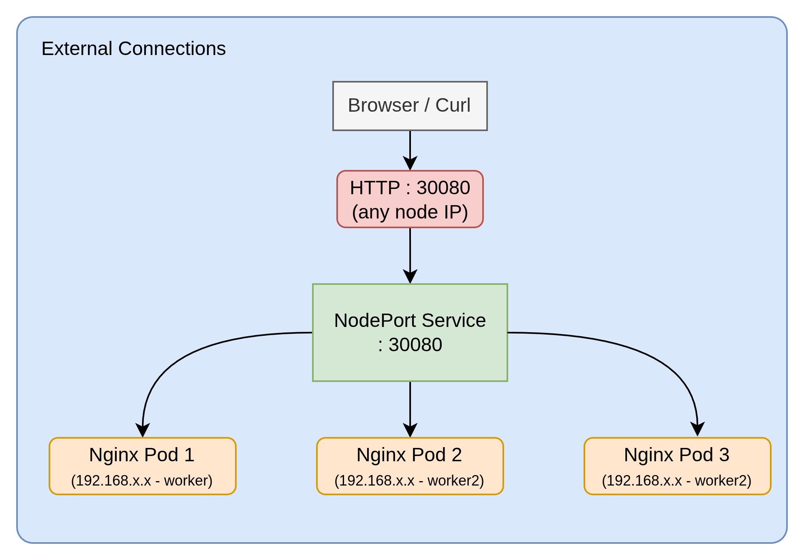
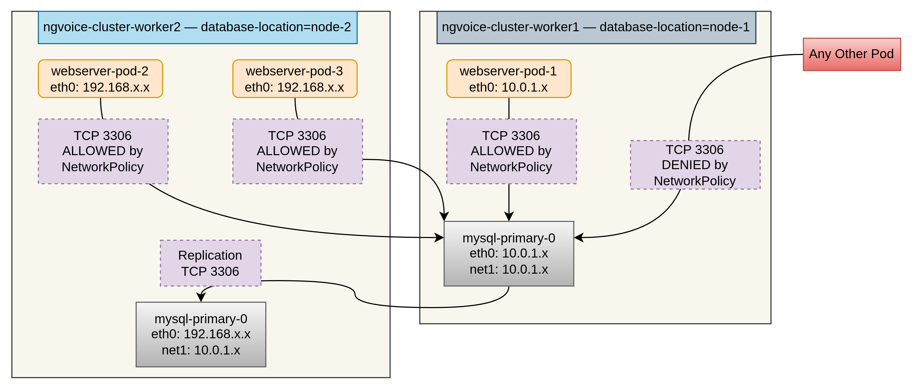
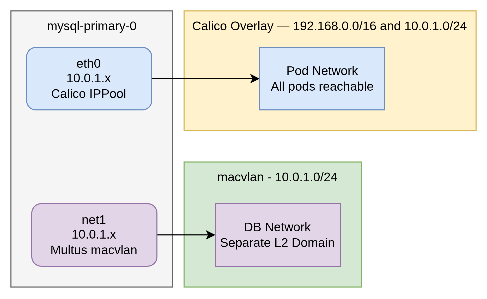
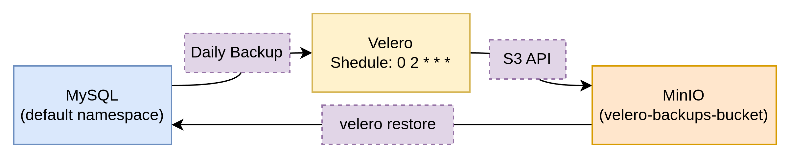
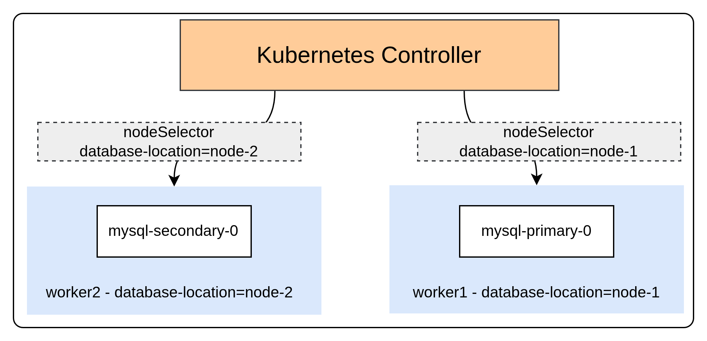

# ng-voice-devops-case-study

## Project Overview

* This case study implements a kubernetes environment locally using "Kubernetes In Docker (KIND)".
* This enables Docker Containers as nodes to simulate cluster environment.
* By leveraging this, I don't have provision 3 clusters either with VM's or separate machines with minikube/k3s.
* The goal of this case study is covering everything from cluster provisioning to disaster recovery by implementing each requirement the way it would be done in the real environment with proper network isolation, secondary networks for pods in different nodes, node affinity, persistent storage and automated scheduled backups.


The same implementation can take further from local environment to the AWS EKS Cluster with minimal changes. Terraform can handle EKS provisioning and necessary network configuration over VPC, Private and Public Subnets, Routing Tables, Load Balancers, Internet Gateways and NAT Gateways.

---

## Stack

| Layer | Tool | Why |
|---|---|---|
| Cluster | KIND | Multi-node local cluster without VMs |
| CNI | Calico | NetworkPolicy enforcement - kindnet ignores policy rules |
| Package management | Helm | Single values.yaml controls everything |
| Database | MySQL 8.0.40 (Bitnami chart) | Primary-secondary replication, StatefulSet |
| Web server | Nginx 1.29-alpine | Lightweight, supports custom config via ConfigMap |
| Secondary network | Calico IPPool + Multus | Two approaches for Requirement 6 |
| Backup | Velero + MinIO | S3-compatible backup, swappable for real S3 on EKS |
| IaC | Terraform | EKS provisioning, clean teardown |


# Architecture

## External Connections


The traffic comes into the system through a NodePort service using port 30080 on any node’s IP address. A local load balancer is not required. However, on EKS, this changes into a LoadBalancer service that uses an Application Load Balancer (ALB) in the background.

## Internal Connections



## Network Layout - Two Networks Per DB Pod


Each MySQL pod has two network connections. The first one, called eth0, is controlled by Calico and gets its IP address from a special IP pool. The second one, called net1, is added by Multus and works as a real second Layer 2 connection with its own route in the network table.
## Disaster Recovery Flow


## Pod Scheduling



# Implementation Checkout

## Kubernetes Cluster Deployment (Locally)
KIND was chosen instead of minikube or k3s because it runs Kubernetes nodes as Docker containers. This lets us create a real multi-node cluster on one machine without using virtual machines. In this case, one control-plane node and two worker nodes create a more realistic test environment for this case study.

A key decision was to disable the default CNI when creating the cluster. KIND’s default CNI, kindnet, does not enforce NetworkPolicy objects. However, Requirement 4 needs real network policy enforcement, so Calico is used instead of kindnet. This choice must be made when the cluster is created, because the CNI cannot be changed later.

```yaml
# kind-config.yaml
networking:
  disableDefaultCNI: true
  podSubnet: "192.168.0.0/16"
```

## DB Cluster with Persistent Data
MySQL runs in a primary–secondary replication mode using the Bitnami Helm chart as a subchart dependency. Each pod has its own PersistentVolumeClaim, so its data stays safe even if the pod restarts.

Using MySQL 8.0.40 is a good production choice because it is a mature, long-lived release with stable behavior that many teams already run in real systems. It has received many bug fixes and security updates, so the upgrade risk is low and issues are usually well known and documented.

The chart uses a StatefulSet instead of a Deployment. A StatefulSet gives stable pod names (for example, `primary-0` and `secondary-0`) and makes sure each pod always reconnects to the same PVC after a restart. A Deployment cannot guarantee fixed names or consistent storage binding in this way.

For the secondary, `replicaCount` is set to 1. There is only one node with the label `node-2`, so using two secondaries with a `nodeSelector` would place both pods on the same machine. This would remove fault isolation, so one secondary per labeled node is the correct design choice.


## Web server Deployment

Nginx runs as a Deployment with 3 replicas and uses a ConfigMap for its custom server configuration. Dynamic page content is generated using init containers and the Kubernetes Downward API.

The Nginx server block is stored in a ConfigMap and mounted at `/etc/nginx/conf.d/default.conf`. The config is not built into the image; it is injected at runtime. To change the config, you only need to update the ConfigMap and restart the pods, instead of rebuilding the image.

An init container runs before Nginx starts. It reads the pod name through the Downward API, takes the last 5 characters, and writes them to a shared `emptyDir` volume. When the main container starts, it reads this file and replaces variables inside the HTML template.

`sed` is used to process the HTML template by replacing variables with the extracted pod name substring. It takes the 5-character string from the init container's output file and substitutes it directly into the page content at startup. `tail -c 6` grabs the last 5 characters plus a newline from the pod name (via Downward API); the shell `$(...)` automatically trims the newline, giving the exact string needed for the substitution.


## DB Network Isolation

Calico NetworkPolicy blocks all incoming traffic to MySQL pods by default and only allows specific connections on port 3306.

The deny-all rule happens automatically. When you set `policyTypes: [Ingress]`, Calico blocks any traffic that does not match the listed rules. You do not need a separate "deny" rule.

Three rules are needed:

**Rule 1**: Web pods connect to MySQL on port 3306. This matches the main requirement.

**Rule 2**: MySQL pods connect to each other on port 3306. The primary and secondary need this for replication.

**Rule 3**: Node network (172.18.0.0/16) connects to MySQL on port 3306. Kubelet health probes come from the node IP.

Without Rule 2, replication fails. Without Rule 3, health probes fail and Kubernetes keeps restarting MySQL pods.

**Label choice**: The policy uses `role: webserver`, a stable static label on web pods. The full `app.kubernetes.io/name` label includes the Helm release name, which changes if you rename the release and breaks access silently.


## Disaster Recovery

Velero handles backup orchestration with MinIO as the in-cluster S3-compatible storage backend. Backups run daily at 2am with 7-day retention.

**Replication vs. backups**: MySQL replication provides high availability. It keeps the database running if a pod fails. However, replication is not disaster recovery. If data gets corrupted or deleted, the secondary copies the problem too. Velero creates independent point-in-time snapshots for real recovery.

**MinIO in-cluster**: Velero uses the S3 API, and MinIO provides it. Running MinIO inside the cluster means no cloud account is needed, and everything works offline. To move to production EKS later, just update the `s3Url` - no other changes required.

**MinIO via Helm**: The official MinIO Helm chart deploys the pod, service, PVC, and creates the backup bucket automatically. The `buckets:` setting in values.yaml handles bucket creation during install - no extra steps needed.

## Connect Pod to a Separate Network

Two network isolation approaches run at the same time.

**Approach 1: Calico IPPool**

A Calico IPPool with `nodeSelector` gives pods on matching nodes IPs from a separate CIDR (10.0.1.0/24) instead of the default (192.168.0.0/16). Calico automatically sets up the routes. The IP separation is easy to see without entering pods.

**Approach 2: Multus + macvlan**

Multus works as a CNI multiplexer alongside Calico. When a pod has the `k8s.v1.cni.cncf.io/networks` annotation, Multus creates `eth0` with Calico (normal pod network) and adds `net1` with macvlan on a true separate L2 network.

| | Calico IPPool | Multus macvlan |
|---|---|---|
| Interfaces | One (eth0) | Two (eth0 + net1) |
| Separation | Different CIDR, same overlay | Separate L2 domain |
| Complexity | Simple | Requires Multus + CNI binaries |
| Use case | IP segregation | Telco, bare-metal DB isolation |

**IPPool vs. Multus**: IPPool meets the basic requirement. Multus provides stronger isolation with a dedicated interface. Both run together.

**KIND workaround**: KIND nodes lack the macvlan binary. On EKS (Amazon Linux), it comes pre-installed. For KIND, a DaemonSet with `alpine:3.19` downloads the CNI plugins at startup.


**Verified with:**

```bash
kubectl exec -it ngvoice-mysql-primary-0 -- hostname -I
# Shows two IPs — eth0 and net1
kubectl exec -it ngvoice-webserver-5649877bdb-4wjsq -- ifconfig
# Shows Pod eth0 IP
```

## Schedule DB Pods on Specific Nodes

Node labels are set once during cluster setup. The `nodeSelector` in `values.yaml` controls exact pod placement. The deployment engineer updates one value and runs one command.

**Why `nodeSelector` over `podAntiAffinity`**: The requirement demands specific placement - `db-x` on `node-1`, `db-y` on `node-2`. This is placement does **pinning**. `podAntiAffinity` distribute pods across different nodes but cannot guarantee which pod lands on which specific node. `nodeSelector` with named labels provides exact, verifiable placement.

**To move primary to different node**:
```
kubectl label node <node-name> database-location=node-1 --overwrite
helm upgrade ngvoice helm-chart/
kubectl delete pod ngvoice-mysql-primary-0
```

No manifest changes. No StatefulSet edits. Just one label update, one Helm upgrade, one pod delete.


## Terraform Infrastructure Code
Terraform manages EKS cluster deployment using a modular structure for reusability and maintainability.

**Root files** (`main.tf`, `provider.tf`, `variables.tf`, `outputs.tf`) orchestrate the overall infrastructure. Standard Terraform state files (`terraform.tfstate`, `.backup`) track deployed resources.

**Modules directory** contains reusable components:
- `eks/`: EKS cluster configuration with node groups and addons
- `vpc/`: Networking setup (subnets, NAT gateways, security groups) 
- `iam/`: Roles, policies, and service accounts for EKS components
- `secrets-manager/`: Secrets storage for database credentials and certificates

**Benefits of this structure**: Each module has its own `main.tf`, `variables.tf`, and `outputs.tf`, making them independently testable and shareable. Root configuration calls modules with environment-specific values, enabling consistent deployments across dev/staging/production. Changes to VPC networking don't require touching EKS code, and teams can own individual modules.